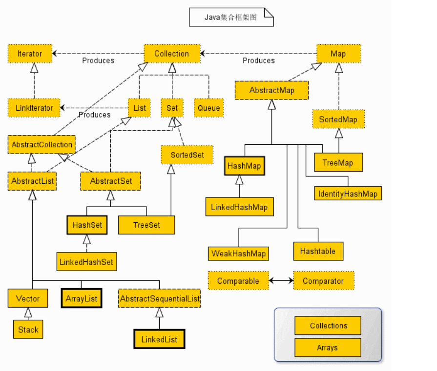

### 集合类

[TOC]

#### 背景：

集合框架被设计成要满足以下几个目标。

- 该框架必须是高性能的。基本集合（动态数组，链表，树，哈希表）的实现也必须是高效的。
- 该框架允许不同类型的集合，以类似的方式工作，具有高度的互操作性。
- 对一个集合的扩展和适应必须是简单的。

	整个集合框架就围绕一组标准接口而设计。你可以直接使用这些接口的标准实现，诸如： **LinkedList**, **HashSet**, 和 **TreeSet** 等,除此之外你也可以通过这些接口实现自己的集合。如下图：

所有的集合框架都包含如下内容：

**接口：**是代表集合的抽象数据类型。例如 **Collection、List、Set、Map** 等。之所以定义多个接口，是为了以不同的方式操作集合对象

**实现（类）：**是集合接口的具体实现。从本质上讲，它们是可重复使用的数据结构，例如：ArrayList、LinkedList、HashSet、HashMap。

**算法：**是实现集合接口的对象里的方法执行的一些有用的计算，例如：搜索和排序。这些算法被称为多态，那是因为相同的方法可以在相似的接口上有着不同的实现。

#### 主要方法：

| 方法                              | 解释                            |
| --------------------------------- | ------------------------------- |
| boolean add(Object o)             | 添加对象到集合                  |
| boolean remove(Object o)          | 删除指定的对象                  |
| int size()                        | 返回当前集合中元素的数量        |
| boolean contains(Object o)        | 查找集合中是否有指定的对象      |
| boolean isEmpty()                 | 判断集合是否为空                |
| Iterator iterator()               | 返回一个迭代器                  |
| boolean containsAll(Collection c) | 查找集合中是否有集合c中的元素   |
| boolean addAll(Collection c)      | 将集合c中所有的元素添加给该集合 |
| void clear()                      | 删除集合中所有元素              |
| void removeAll(Collection c)      | 从集合中删除c集合中也有的元素   |
| void retainAll(Collection c)      | 从集合中删除集合c中不包含的元素 |

