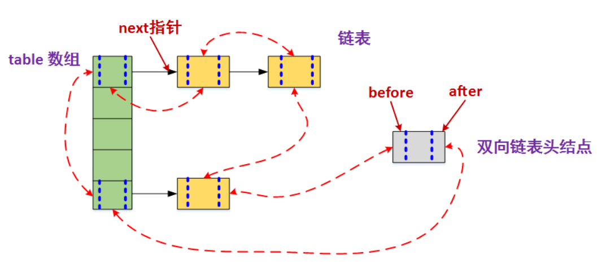

### LinkedHashMap

定义：

	HashMap和双向链表合二为一即是LinkedHashMap。所谓LinkedHashMap，其落脚点在HashMap，因此更准确地说，它是一个将所有Entry节点链入一个双向链表的HashMap。

	由于LinkedHashMap是HashMap的子类，所以LinkedHashMap自然会拥有HashMap的所有特性

	特别地，该迭代顺序可以是**插入顺序**，也可以是**访问顺序**。因此，根据链表中元素的顺序可以将LinkedHashMap分为：保持插入顺序的LinkedHashMap和保持访问顺序的LinkedHashMap，其中LinkedHashMap的默认实现是按插入顺序排序的。




**特点：**

	**与HashMap不同的是它维持有一个双链表，从而可以保证迭代时候的顺序。**

	非线程安全的


源码（java8）

```
static class Entry<K,V> extends HashMap.Node<K,V> {
        Entry<K,V> before, after;
        Entry(int hash, K key, V value, Node<K,V> next) {
            super(hash, key, value, next);
        }
    }

    private static final long serialVersionUID = 3801124242820219131L;

    /**
     * The head (eldest) of the doubly linked list.
     */
    transient LinkedHashMap.Entry<K,V> head;

    /**
     * The tail (youngest) of the doubly linked list.
     */
    transient LinkedHashMap.Entry<K,V> tail;

    /**
     * The iteration ordering method for this linked hash map: <tt>true</tt>
     * for access-order, <tt>false</tt> for insertion-order.
     *
     * @serial
     */
     // 如果accessOrder为true的话，则会把访问过的元素放在链表后面，放置顺序是访问的顺序 
	 // 如果accessOrder为flase的话，则按插入顺序来遍历
	 // 默认accessOrder的值为false
    final boolean accessOrder;
```


```
// 构造方法自定义 顺序

public LinkedHashMap(int initialCapacity, 
					float loadFactor, 
					boolean accessOrder) 
		{    
			super(initialCapacity, loadFactor);    
			this.accessOrder = accessOrder;
		}
```


